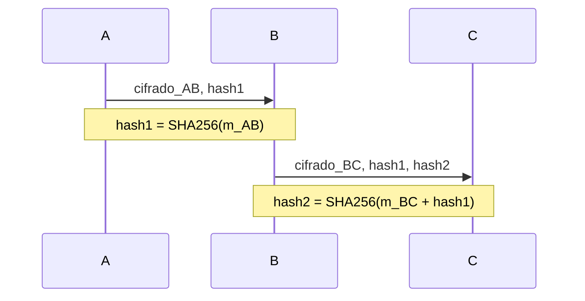

## EJERCICIOS PROPUESTOS (HASH + CIFRADO)

### Ejercicio D — Cadena de hashes en reenvío (solo Fernet)

**Dificultad:** Media-Alta | **Conceptos:** Fernet, SHA256, hash encadenado, integridad trazable

**Escenario:** Tres nodos (A, B, C) intercambian facturas por canales simétricos distintos. No hay RSA ni ECDSA: la trazabilidad se garantiza encadenando hashes SHA256. Si B altera un mensaje pero reutiliza el hash de A, C lo detecta.

**Flujo:**




**Tareas:**

1. `enviar_AB()`: calcular `hash1 = SHA256(mensaje).digest()`, cifrar con Fernet clave_AB, retornar `(cifrado, hash1)`.
2. `recibir_AB()`: descifrar, recalcular hash, comparar con `hash1` en bytes.
3. `reenviar_BC()`: tras validar, calcular `hash2 = SHA256(mensaje_BC + hash1).digest()` (concatenar bytes), cifrar con clave_BC, retornar `(cifrado_BC, hash1, hash2)`.
4. `recibir_BC()`: descifrar, verificar `hash1` coherente y `hash2 == SHA256(m_BC + hash1)`.
5. `simular_ataque_B()`: B cambia un byte del mensaje reenviado pero deja `hash1` original; C debe fallar en la verificación de `hash2`.

**Datos:**

```python
mensaje_AB = b"Factura 2024-INV-001: importe 12.500 EUR."
mensaje_BC = b"Factura validada por B. Autorizar pago."
```

**Pista examen:** el hash viaja en **bytes** (`digest()`); solo usar `hexdigest()` si el enunciado pide guardarlo en JSON o fichero texto.


### Ejercicio E — Auth + fichero cifrado + token de sesión en el hash del mensaje

**Dificultad:** Alta | **Conceptos:** PBKDF2, Fernet, SHA256, RSA híbrido, firma interna

**Escenario:** Un hospital guarda `medicos.txt` **cifrado en disco** (no en texto plano). Solo tras autenticarse con PBKDF2 se descifra el fichero, se genera un token de sesión y los mensajes clínicos incluyen un hash ligado a esa sesión dentro del payload Fernet.

**Flujo:**

1. **Registro:** `alta_usuario()` escribe `nombre,salt_b64,hash_pwd` en `medicos.txt` en claro temporalmente; al cerrar, cifra **todo el fichero** con Fernet usando `clave_maestra` derivada de PBKDF2 de una contraseña admin (`clave_admin_secreta`). Guarda `medicos.txt.enc`.
2. **Autenticación:** el médico introduce usuario y contraseña. El sistema descifra `medicos.txt.enc` con la clave maestra, busca la línea del usuario, verifica con `PBKDF2HMAC.verify()`. Si falla, aborta sin exponer el fichero.
3. **Token de sesión:** si la auth es correcta, `token_sesion = hashlib.sha256(f"{usuario}:{timestamp}:{salt_sesion}".encode()).hexdigest()`.
4. **Mensaje híbrido A→B:** payload JSON interno (luego cifrado con Fernet + RSA):

```json
{
  "mensaje": "<base64>",
  "firma": "<base64 firma RSA de A>",
  "hash_msg": "<hex de SHA256(token_sesion.encode() + mensaje)>"
}
```

1. **Receptor B:** descifra híbrido, comprueba `hash_msg`, verifica firma RSA de A, imprime mensaje solo si ambas pasan.

**Datos:**

```python
clave_maestra_pwd = "clave_admin_secreta"
mensaje_AB = b"Alta paciente: Juan Garcia, DOB 1980-03-15."
```

**Novedad respecto al ejercicio 1:** el fichero de credenciales está protegido por cifrado simétrico; el hash del mensaje depende del **token de sesión**, no solo del contenido.

**Pista examen:** `hash_msg` en el JSON va en **hex** (`hexdigest()`); `token_sesion` también puede ir en hex; el mensaje y la firma en **base64**.